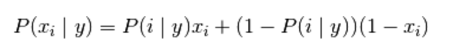

Machine Learning with Naive Bayes
==================

Brought to you by [Lesley Cordero](http://www.columbia.edu/~lc2958), [Byte Academy](byteacademy.co), and [ADI](adicu.com).

## Table of Contents

- [0.0 Setup](#00-setup)
	+ [0.1 Python and Pip](#01-python-and-pip)
	+ [0.2 R and R Studio](#02-r-and-r-studio)
	+ [0.2 Packages](#02-packages)
	+ [0.3 Virtual Environment](#03-virtual-environment)	

## 0.0 Setup

This guide was written in R 3.2.3 and Python 3.5.

### 0.1 Python and Pip

Download [Python](https://www.python.org/downloads/) and [Pip](https://pip.pypa.io/en/stable/installing/).

Let's install the modules we'll need for this tutorial. Open up your terminal and enter the following commands to install the needed python modules: 

```
pip3 install scikit-learn
pip3 install scipy
```

### 0.2 R and R Studio

Install [R](https://www.r-project.org/) and [R Studio](https://www.rstudio.com/products/rstudio/download/).

Next, to install the R packages, cd into your workspace, and enter the following, very simple, command into your bash: 

```
R
```

This will prompt a session in R! From here, you can install any needed packages. For the sake of this tutorial, enter the following into your terminal R session:

```
install.packages("")
```


## 1.0 Introduction

Naive Bayes works on Bayes Theorem of probability to predict the class of a given data point. Naive Bayes is extremely fast compared to other classification algorithms and works with an assumption of independence among predictors. 

The Naive Bayes model is easy to build and particularly useful for very large data sets. Along with simplicity, Naive Bayes is known to outperform even highly sophisticated classification methods.

### 1.1 Bayes Theorem

Recall Bayes Theorem, which provides a way of calculating the posterior probability. Its formula is as follows:


### 1.2 Overview

Let's go through an example of how the Naive Bayes Algorithm works. We'll go through a classification problem that determines whether a sports team will play or not based on the weather. 

Let's load the module data:

``` python
import pandas as pd
f1 = pd.read_csv("./weather.csv")
```

#### 1.2.1 Frequency Table

The first actual step of this process is converting the dataset into a frequency table. Using the `groupby()` function, we get the frequencies:

``` python
df = f1.groupby(['Weather','Play']).size()
```

Now let's split the frequencies by weather and yes/no. Let's start with the three weather frequencies:

``` python
df2 = f1.groupby('Weather').count()
```

Now let's get the frequencies of yes and no:

``` python
df1 = f1.groupby('Play').count()
```

#### 1.2.2 Likelihood Table


Next, you would create a likelihood table by finding the probabilites of each weather condition and yes/no. This will require that we add a new column that takes the play frequency and divides it by the total data occurances. 


``` python
df1['Likelihood'] = df1['Weather']/len(f1)
df2['Likelihood'] = df2['Play']/len(f1)
```

This gets us a dataframe that looks like:

```
          Play  Likelihood
Weather                   
Overcast     4    0.285714
Rainy        5    0.357143
Sunny        5    0.357143
```

Now, we're able to use the Naive Bayesian equation to calculate the posterior probability for each class. The highest posterior probability is the outcome of prediction.

#### 1.2.1 Calculation

So now we need a question. Let's propose the following: "Players will play if the weather is sunny. Is this true?"

From this question, we can construct Bayes Theorem. So what's our P(A|B)? P(Yes|Sunny), which gives us:

P(Yes|Sunny) = (P(Sunny|Yes)*P(Yes))/P(Sunny)

Based off the likelihood tables we created, we just grab P(Sunny) and P(Yes). 

``` python
ps = df2['Likelihood']['Sunny']
py = df1['Likelihood']['Yes']
```

That leaves us with P(Sunny|Yes). This is the probability that the weather is sunny given that the players played that day. In `df`, we see that the total number of `yes` days under `sunny` is 3. We take this number and divide it by the total number of `yes` days, which we can get from `df`. 

``` python
psy = df['Sunny']['Yes']/df1['Weather']['Yes']
```

Now, we just have to plug these variables into bayes theorem: 

``` python
p = (psy*py)/ps
```

And we get:

```
0.59999999999999998
```

That means the answer to our original question is yes!

## 2.0 Naive Bayes Types

With `scikit-learn`, we can implement Naive Bayes models in Python. There are three types of Naive Bayes models, all of which we'll review in the following sections.


### 2.1 Gaussian

The Gaussian Naive Bayes Model is used in classification and assumes that features will follow a normal distribution. 

We begin an example by importing the needed modules:

``` python
from sklearn.naive_bayes import GaussianNB
import numpy as np
```

As always, we need predictor and target variables, so we assign those:

``` python
x = np.array([[-3,7],[1,5], [1,2], [-2,0], [2,3], [-4,0], [-1,1], [1,1], [-2,2], [2,7], [-4,1], [-2,7]])

y = np.array([3, 3, 3, 3, 4, 3, 3, 4, 3, 4, 4, 4])
```

Now we can initialize the Gaussian Classifier:

``` python
model = GaussianNB()
```

Now we can train the model using the training sets:
``` python
model.fit(x, y)
```

Now let's try out an example:
``` python
predicted = model.predict([[1,2],[3,4]])
```

We get:
```
([3,4])
```

### 2.2 Multinomial

MultinomialNB implements the multinomial Naive Bayes algorithm and is one of the two classic Naive Bayes variants used in text classification. 


### 2.3 Bernoulli

BernoulliNB implements the Naive Bayes training and classification algorithms for data that is distributed according to multivariate Bernoulli distributions, meaning there may be multiple features but each one is assumed to be a binary value. 

The decision rule for Bernoulli Naive Bayes is based on




